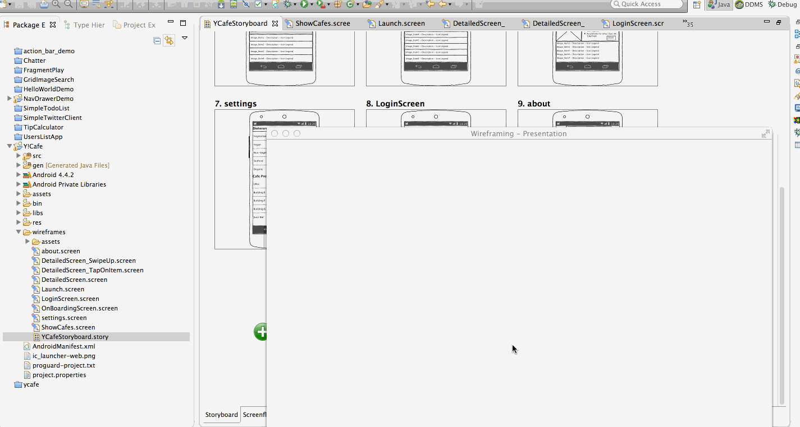

ycafe
=====

This is our AndroidBootcamp group project.

## Objective
Develop Y!Cafe app which allows user to view menu for a day(week) at each cafe in the Sunnyvale Campus.					

The User stories we are aiming to complete are:
 - [ ] User can see a list of all Cafe's in Sunnyvale campus (For example, URLs, Buliding E etc)				
 - [ ] User can select one of the cafe's to see today's menu				
 - [ ] User can select a particular day to look for the menu				
 - [ ] User can see menu (Breakfast/Lunch/Dinner) for 1 week from yesterday				
 - [ ] User should be able to set dietary preferences in settings view.				
 - [ ] User by default should be able to select menu as par dieteray settings. 				
 - [ ] User should be able to select preferred cafe in setttings view.				
 - [ ] User by default should be able to see cafe as par dieteray settings. 				
 - [ ]  <i>(Optional)</i> User can see whether cafe if open or closed					
 - [ ]  <i>(Optional)</i> User can post feedback on the recipes					
 - [ ]  <i>(Optional)</i> User should be able to see contact details for cafe					
 - [ ]  <i>(Optional)</i> If user click on phone no or on email id of the contact person, he should be able to call/send email.	
 - [ ]  <i>(Optional)</i> User can see type of menu item, for example Vegetarian, Vegan etc. Every menu type has image.	
 - [ ]  <i>(Optional)</i> User logs in the login page using bouncer credentials					
 - [ ]  <i>(Optional)</i> Send push notificaiton for menu 3 times a day.
 - [ ]  <i> (Stretch) </i>  User can see list of all receipes				
 - [ ]  <i>(Stretch) </i>  User can get details of a particular recipe				
 - [ ]  <i>(Stretch) </i>   User can share recipes on facebook.				
 - [ ]  <i>(Stretch) </i>    User can subscribe menu in the email.				
 - [ ]  <i>(Stretch) </i>   Customize time settings for push notification.				
 - [ ]  <i>(Stretch) </i>   User can see menu icon legend				
 - [ ]  <i>(Stretch) </i>   Send healthy tips through local push notification.
 
 ## References
  - [Project Guidelines](https://yahoo.jiveon.com/docs/DOC-3046)
  - [Yahoo Cafe](http://yahoo.cafebonappetit.com/)
  - [Yahoo Cafe Rest API](http://legacy.cafebonappetit.com/api/1/cafe/684/date/2014-01-27/format/json)
  - [User stories are listed in here](https://docs.google.com/a/yahoo-inc.com/spreadsheets/d/1o7L3EZ0gTAinz4YtD5j3mMmCx_6iU2A9p9A6t-osXTQ/edit#gid=0)

## Workflow

  
